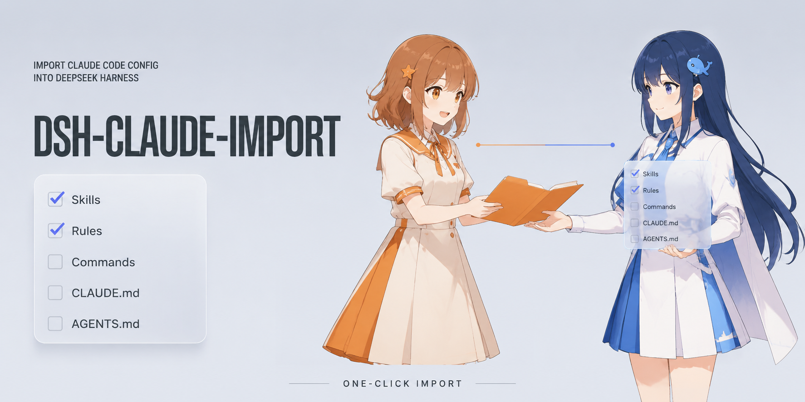

# dsh-claude-import



把 Claude Code 的配置资产一键导入 DeepSeek Harness（DSH）：在设置页「插件 → 插件配置」提供
「导入 Claude 配置」卡片，勾选要导入的资产，选择用户级或项目工作区，预览落点与冲突，
逐项选择冲突策略后导入。重复导入幂等，不产生重复条目。

## 功能

- **五类资产**：skills / rules / commands / CLAUDE.md / AGENTS.md，逐项勾选；
- **两种范围**：用户级（`~/.claude`）与项目级（选定工作区的 `.claude` 目录，复用 DSH 原生目录选择器）；
- **落点预览**：导入前逐项展示 源 → 目标、当前状态（新增 / 已一致 / 冲突 / 源已更新 / 已有等效内容 / 暂不支持）与摘要；
- **冲突三策略**：覆盖 / 合并 / 跳过，逐项可选；
- **幂等**：文本资产以标记块写入，重复导入自动识别；技能目录按内容指纹比对，一致即跳过；
- **安全处理 Windows 目录联接（junction）**：目标为联接且内容一致时不动它；覆盖/合并会先摘除联接、绝不写穿到联接指向的目录。

## 落点映射

| Claude 资产 | DSH 落点 |
|---|---|
| `~/.claude/skills/<name>` | `~/.agents/skills/<name>`（官方扫描根，rank 500） |
| `<ws>/.claude/skills/<name>` | `<ws>/.agents/skills/<name>`（项目扫描根，rank 200） |
| `~/.claude/CLAUDE.md`、`~/.claude/AGENTS.md`、`~/.claude/rules/*.md` | 以带标记的块合并进 `~/.dsh/AGENTS.md`（用户级指令文件） |
| `<ws>/.claude/CLAUDE.md` 等 | 以带标记的块合并进 `<ws>/AGENTS.md`（项目级候选文件，会话 cwd 位于项目内时生效） |
| `commands/*.md` | 无直接落点（DSH 命令为代码注册制），检测到则提示暂不支持并跳过 |

指令文本块形如：

```markdown
<!-- dsh-claude-import:begin id="user:rules/engineering-conduct.md" -->

## [dsh-claude-import] rules/engineering-conduct.md

…源文件原文…

<!-- dsh-claude-import:end id="user:rules/engineering-conduct.md" -->
```

重复导入时按块 id 定位：内容一致 → 无改动；源已更新 → 覆盖 / 合并（追加） / 跳过。
目标中已存在等效内容但无标记（例如先前的其他方式合并）时视为已导入，跳过以免重复。

## 安装

### 官方路径（任何机器）

```sh
dsh plugin --profile web add dsh-claude-import
# 重启 DSH（web profile）后生效
```

`dsh plugin` 会把包写入 profile 依赖，并因其声明了 `dsh.bundle` 自动加入
`dsh.profile.bundles`；插件自带 `cordis.patch.yml`（bundle patch）把 Loader 行挂进组合。

### 本地源码开发（file: 依赖）

```sh
cd ~/.dsh/profiles/web
pnpm add "file:C:/path/to/dsh-claude-import"
```

随后把包名写进 profile 自己的 `cordis.patch.yml`（用户补丁层支持热重载，免重启）：

```yaml
- insert:
    - id: claude-import
      name: dsh-claude-import
```

## 使用

设置 → 插件 → 插件配置 → 「Claude 配置导入」→ 导入 Claude 配置：

1. 勾选资产类型（默认全选）；
2. 保持「用户级（全局）」，或点「选择工作区…」选定项目目录（追加项目级资产）；
3. 点「预览落点」查看逐项计划与冲突；
4. 冲突项在下拉框选择 覆盖 / 合并 / 跳过；
5. 点「开始导入」，完成后逐项显示结果。

## 架构与开发

- `lib/index.js`：宿主插件薄壳。提供 `claudeImport` 服务（继承 `TypertRemoteService`），
  RPC 方法 `preview` / `execute` 经 Typert 网关暴露给浏览器；每次调用以带缓存戳的 URL
  动态导入 `lib/import-logic.js`，改逻辑文件后下一次调用即生效（开发期免重启宿主）。
- `lib/import-logic.js`：纯函数核心（扫描 / 指纹比对 / 块管理 / 三策略 / 幂等），
  不依赖 DSH 运行时，可用纯 Node 单测。
- `lib/typert.host.js`：手工维护的 Typert 宿主面（zod 严格 schema），由官方
  typert-loader 自动发现并注册，`dsh plugin add` 安装时无需构建步骤。
- `lib/client.js`：浏览器端插件，按官方客户端模块协议以
  `window.__ModuleLoader__.load({ id, factory })` 形态打包，只从共享模块表 require
  （react、dsh-client-ui-primitives），在 `settings.plugin.item` 槽注册设置卡片。
- `tests/import-logic.test.mjs`：纯 Node 单测，`node tests/import-logic.test.mjs`。
- `scripts/gui-verify.cjs`：用本机已缓存的 Playwright Chromium 对 GUI 做端到端探查
  （explore / card / preview / run / conflict 五步）。

客户端改动会被 web profile 的 client-hmr 每 500ms 轮询到并热刷进浏览器；宿主薄壳
与 `typert.host.js` 变更需要重挂 Loader 行（改 `cordis.patch.yml` 触发重载，注意 Node
模块缓存以 URL 为键，改名或重启才能换新模块）。

## 已知限制（Known Limitations）

- commands 暂无落点（DSH 命令为代码注册制），导入时提示暂不支持并跳过；后续方案 TODO。
- 规则文件的原样内容（含 Claude 规则 frontmatter）整体进入标记块，不做语义改写；
  目标指令文件中此前的非标记合并内容不会被自动删除。
- 项目级指令合并进 `<ws>/AGENTS.md`，在打开该工作区的会话中生效（官方项目级候选文件）。
- 本包无构建步骤、无运行时第三方依赖（zod/schemastery/cordis 等经 DSH 官方
  `profiles/node_modules` 回落层解析），因此不声明 npm 依赖；这是官方文档约定的
  out-of-tree 插件解析方式。

## License

MIT
